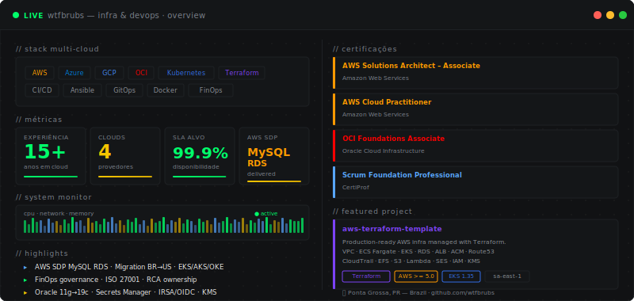

<b>Bruno de Lima</b>  · Infrastructure & DevOps · 15+ years building at scale · Multi-cloud | Kubernetes | FinOps | AWS | Azure | GCP | OCI

---

**Cloud**

**Infrastructure & Automation**

**CI/CD & GitOps**

**Observability & Security**

**Databases**

---

**Featured Project**

**[aws-terraform-template](https://github.com/wtfbrubs/aws-terraform-template)** — Production-ready AWS infrastructure template managed with Terraform. Covers VPC, ECS Fargate, EKS, RDS MySQL, ALB, ACM, Route53, CloudTrail, EFS, S3, Lambda, SES, IAM and more — with GitLab CI and GitHub Actions pipelines including cost estimation via Infracost.

Modules: `vpc` · `ec2` · `ec2-crons` · `ecs` · `ecs-service` · `eks` · `rds` · `alb` · `acm` · `route53` · `s3` · `efs` · `lambda` · `cloudtrail` · `dlm` · `ses` · `codecommit-repo` · `iam`

Security highlights: secrets via Secrets Manager · IRSA (OIDC) on EKS · KMS encryption at rest · RDS password rotation · `deletion_protection` on audit buckets

---

**[LinkedIn](https://www.linkedin.com/in/brunodelima1/)** · 📍 Ponta Grossa, PR — Brazil

